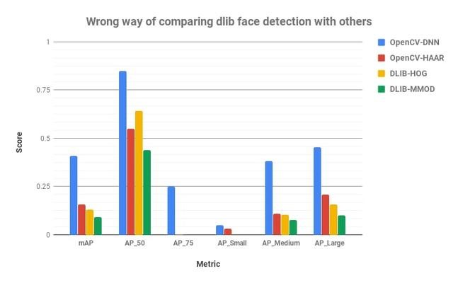
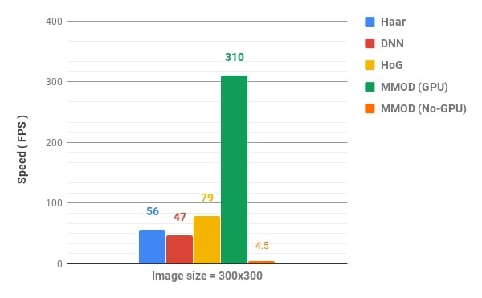
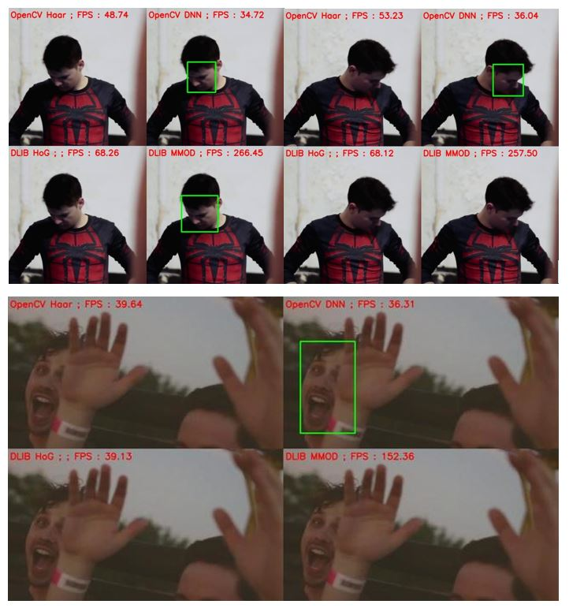
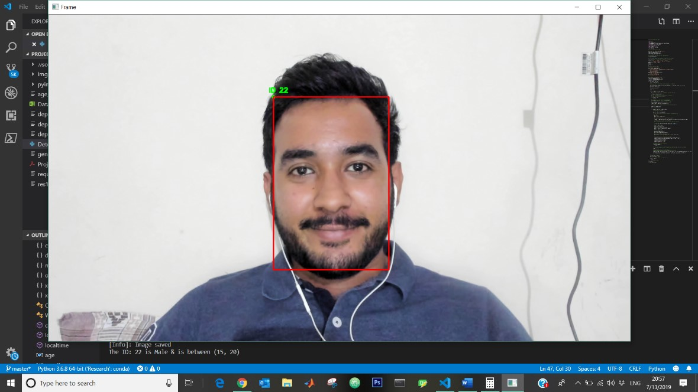
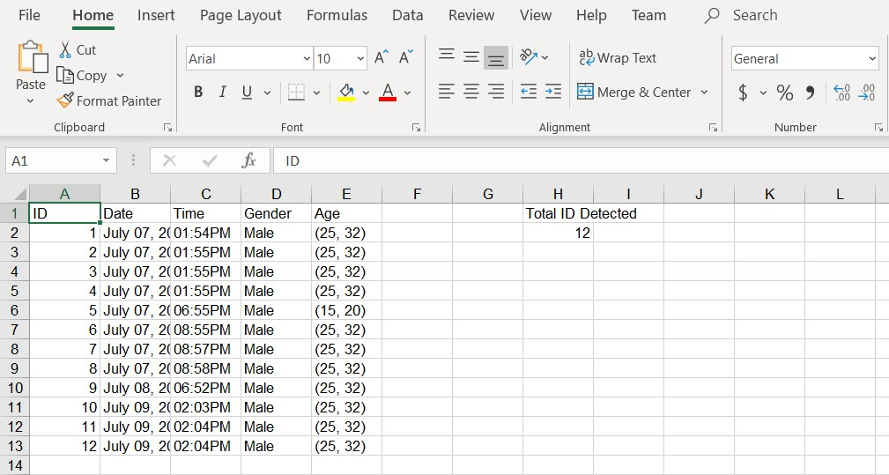

# Gender-and-Age-Detection-based-Customer-Tracking-Classification
This algorithm tracks a person entering from a particular direction while his/her gender &amp; age group are predicted &amp; stored with the respective time of detection.

Download weights file: [Download Link](https://www.dropbox.com/sh/gzo6mz3ri7gwgmq/AADgFxJpPCTPUOlgDLdIe66ra?dl=0)

Identifying the data of potential customers passing by a specific spot in a market can help an investor in choosing the right business to be started on that spot. Mainly two main parameters that are very important in this regard are gender ratio & age parity of the people that pass by a specific spot. By keeping that in mind I made an algorithm in which I trained models for:
•	Face detection
•	Age detection
•	Gender detection
I then deployed these models on the frames of a camera feed that can be subjected to a spot suitable for a above mentioned application. I then saved that data gathered in an Excel-Database so that can be used later. As the data-sets used to train age group consisted of cropped faces with facing towards the camera so this constraint will catered for in future when it will have enough labeled data from the specified orientation.

This project is divided into two parts which are as follows:

    •	Training Age/Gender detection model.
    •	Implementing the model for extracting predictions.

## Model Training:

### Face Detection:
Before moving to the main objective, the first task was to detect a face in our video to pinpoint the points as to where we will apply our predicted models. Otherwise it will increase the computations many folds. 
    
    So, as there are many methods available for detecting face. The following methods were tested so that the best one for our application can be used:
    
    1.	Haar Cascade Face Detector in OpenCV
    2.	Deep Learning based Face Detector in OpenCV
    3.	HoG Face Detector in Dlib
    4.	Deep Learning based Face Detector in Dlib

The second one performed better in our testing phase as the others were skipping a lot of faces. The second model was included in OpenCV from version 3.3. It is based on Single-Shot-Multibox detector and uses ResNet-10 Architecture as backbone. The model was trained using images available from the web, but the source is not disclosed. OpenCV provides 2 models for this face detector.

    •	Floating point 16 version of the original Caffe implementation (5.4 MB)
    •	8-bit quantized version using TensorFlow (2.7 MB)

We used the floating point 16 version file as it was more powerful in terms of accuracy as the people in our application will be in motion. The method has the following merits :

    •	Most accurate out of the four methods
    •	Runs at real-time on CPU
    •	Works for different face orientations – up, down, left, right, side-face etc.
    •	Works even under substantial occlusion
    •	Detects faces across various scales (detects big as well as tiny faces)

The DNN based detector overcomes all the drawbacks of Haar cascade-based detector, without compromising on any benefit provided by Haar. We could not see any major drawback for this method except that it is slower than the Dlib HoG based Face Detector.
I tried to evaluate the 4 models using the FDDB dataset using the script used for evaluating the OpenCV-DNN model. However, I found surprising results. Dlib had worse numbers than Haar, although visually dlib outputs look much better. Given below are the Precision scores for the 4 methods.

Where,

    •	AP_50 = Precision when overlap between Ground Truth and predicted bounding box is at least 50% (IoU = 50%)
    •	AP_75 = Precision when overlap between Ground Truth and predicted bounding box is at least 75% (IoU = 75%)
    •	AP_Small = Average Precision for small size faces (Average of IoU = 50% to 95%)
    •	AP_medium = Average Precision for medium size faces (Average of IoU = 50% to 95%)
    •	AP_Large = Average Precision for large size faces (Average of IoU = 50% to 95%)
    •	mAP = Average precision across different IoU (Average of IoU = 50% to 95%)
    
    
Dlib is faster than the model we used but the major issue with dlib is its’s inability to detect small faces which further drags down the numbers.
I used a 300×300 image for the comparison of the methods. The MMOD detector can be run on a GPU, but the support for NVIDIA GPUs in OpenCV is still not there. So, we evaluate the methods on CPU only and report result for MMOD on GPU as well as CPU.

Hardware used:

      •	Processor: Intel Core i7 6850K – 6 Core
      •	RAM: 32 GB
      •	GPU: NVIDIA GTX 1080 Ti with 11 GB RAM
      •	OS: Linux 16.04 LTS
      •	Programming Language: Python

We run each method 10000 times on the given image and take 10 such iterations and average the time taken. Given below are the results:

In our application the basic issue was off the non-frontal faces as they can be described as looking towards right, left, up, down. Again, to be fair with dlib, we make sure the face size is more than 80×80. Given below are some examples.

### Age & Gender model training:
The network architecture that we used throughout our experiments for both age and gender classification is illustrated in Figure 4.

The network comprises of only three convolutional layers and two fully connected layers with a small number of neurons. Our choice of a smaller network design is motivated both from our desire to reduce the risk of overfitting as well as nature of the problems we are attempting to solve: age classification on the Adience set requires distinguishing between eight classes; gender only two.

#### Model Description:
All three-color channels are processed directly by the network. Images are first rescaled to 256×256 and a crop of 227×227 is fed to the network. The three subsequent convolutional layers are then defined as follows:

    1.	96 filters of size 3×7×7 pixels are applied to the input in the first convolutional layer, followed by a rectified linear operator (ReLU), a max pooling layer taking the maximal value of 3×3 regions with two-pixel strides and a local response normalization layer. 
    2.	The 96×28×28 output of the previous layer is then processed by the second convolutional layer, containing 256 filters of size 96×5×5 pixels. Again, this is followed by ReLU, a max pooling layer and a local response normalization layer with the same hyper parameters as before.
    3.	Finally, the third and last convolutional layer operates on the 256×14×14 blob by applying a set of 384 filters of size 256×3×3 pixels, followed by ReLU and a max pooling layer.
    The following fully connected layers are then defined by: 
    4.	A first fully connected layer that receives the output of the third convolutional layer and contains 512 neurons, followed by a ReLU and a dropout layer.
    5.	A second fully connected layer that receives the 512- dimensional output of the first fully connected layer and again contains 512 neurons, followed by a ReLU and a dropout layer.
    6.	A third, fully connected layer which maps to the final classes for age or gender. 

Finally, the output of the last fully connected layer is fed to a soft-max layer that assigns a probability for each class. The prediction itself is made by taking the class with the maximal probability for the given test image.

#### Testing & Training:
##### Initialization: 

The weights in all layers are initialized with random values from a zero mean Gaussian with standard deviation of 0.01. To stress this, we do not use pre-trained models for initializing the network; the network is trained, from scratch, without using any data outside of the images and the labels available by the benchmark. This, again, should be compared with CNN implementations used for face recognition, where hundreds of thousands of images are used for training. Target values for training are represented as sparse, binary vectors corresponding to the ground truth classes. For each training image, the target, label vector is in the length of the number of classes (two for gender, eight for the eight age classes of the age classification task), containing 1 in the index of the ground truth and 0 elsewhere.

##### Network training:

Aside from our use of a lean network architecture, we apply two additional methods to further limit the risk of overfitting. First, we apply dropout learning (i.e. randomly setting the output value of network neurons to zero). The network includes two dropout layers with a dropout ratio of 0.5 (50% chance of setting a neuron’s output value to zero). Second, we use data augmentation by taking a random crop of 227 × 227 pixels from the 256 × 256 input image and randomly mirror it in each forward-backward training pass. Training itself is performed using stochastic gradient decent with image batch size of fifty images. The initial learning rate is e −3, reduced to e −4 after 10K iterations.

##### Prediction:

We experimented with two methods of using the network in order to produce age and gender predictions for novel faces: 

    •	Center Crop: Feeding the network with the face image, cropped to 227×227 around the face center. 
    •	Over-sampling: We extract five 227×227 pixel crop regions, four from the corners of the 256 × 256 face image, and an additional crop region from the center of the face. The network is presented with all five images, along with their horizontal reflections. Its final prediction is taken to be the average prediction value across all these variations. 

Due to the small misalignments in the Adience images, caused by the many challenges of these images (occlusions, motion blur, etc.) can have a noticeable impact on the quality of our results. This second, over-sampling method, is designed to compensate for these small misalignments, bypassing the need for improving alignment quality, but rather directly feeding the network with multiple translated versions of the same face.

### Implementing the Models:

This algorithm is a multi-model DNN program that is optimized for low computation. This algorithm works in different little parts. The method involves:

    •	Firstly, faces are detected in the frame using OpenCV’s Deep Learning based Face Detector: res10_300x300_ssd_iter_140000.caffemodel.
    •	Secondly, age and gender of every person is predicted also using caffe models that were trained previously.
    •	Each person is then assigned an ID and tracked over time, even when they are out of the frame for not so long (5 seconds), whenever they come back in the frame, their ID will remain the same.
    •	A picture of the person is then saved with respect to their ID number & the prediction is saved in the Excel Database.

## Requirements:
There is a requirement.txt file in the project files that can be used to install required libraries. The important libraries used in this algorithm are as follows:

    OpenCV==3.4.1
    openpyxl==2.6.2
    xlrd==1.2.0
    XlsxWriter==1.1.8
    xlutils==2.0.0
    xlwings==0.15.8
    xlwt==1.3.0

OpenCV must be installed manually while rest of the files can easily be downloaded by using this command: 
        
        pip install --user --requirement requirements.txt

## Implementation:

To implement the program user has to enter python Detect.py & it will run the program, to turn off the video stream you have to comment out line # 161.

## Explanation:

The code initially loads all the required models. It then initializes the video-stream & that stream is subjected to our first model that is face detection. After the face is detected the first step involves assigning an id number to this detected contour. After that the program waits for 0.5 seconds to fetch a face from a frame so that it is not at the border or not occluded. This face image is then converted to blob object of 277×277 which is then sent to the gender prediction & age prediction model serially. The results are then written in the excel file with the corresponding ID, date & time. The person is tracked in the frame until he leaves the frame & the other person enters. The output file is in this manner;

Whereas the respective images are saved with variable sizes depending on the distance of person from camera.

## Troubleshooting:

Following issues were catered for while writing this algorithm:

    •	The main issue that I was stuck was in the beginning was with OpenCV, as it keeps on skipping frames due to which the assertion failed error was a biggest flaw & to overcome that I had to reduce frame rate to an optimal number.
    •	I also came across the memory issue where due to using the age & gender models continuously on each frame was using much of the core & GPU resources of the system. So, to overcome that I only performed age & gender computation once on the face image.
    •	Another issue was tracking & retaining the same person in the frame. As it was detecting a face on each frame, as I was matching the faces with the previous one which was computationally expensive. I used centroid tracking by pyimagesearch that reduced that computation for me as it was retaining the tracked faces as centroid for 5 seconds at least.
    •	The models for age & gender were trained accordingly as explained in this paper: Age and Gender Classification Using Convolutional Neural Networks.
